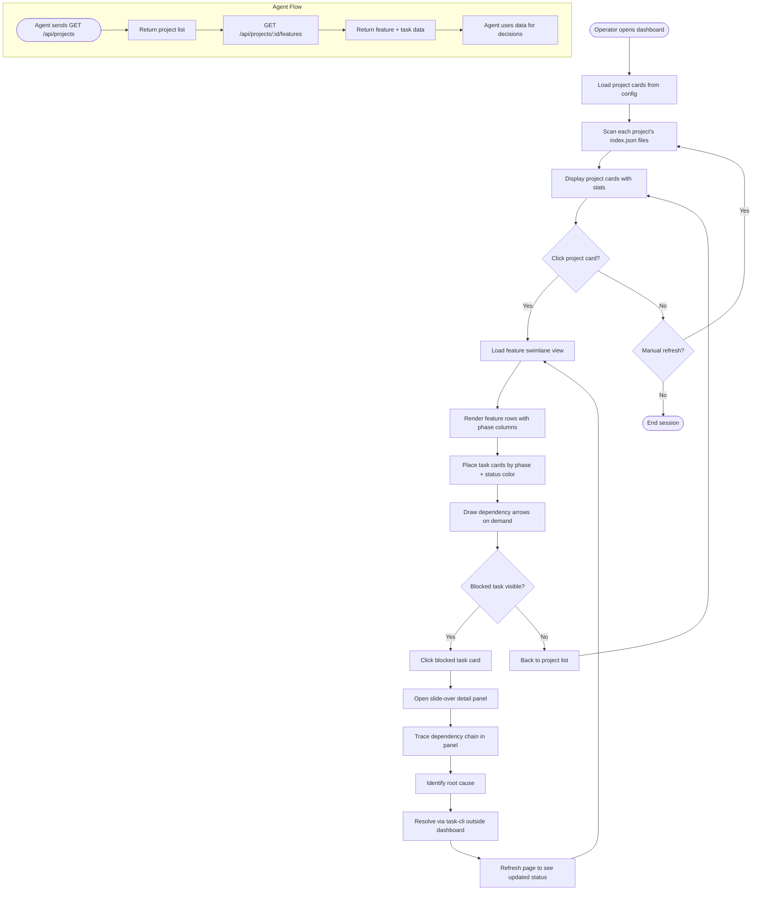

# Agent Task Dashboard — PRD Spec

> PRD Spec: defines WHAT the feature is and why it exists.

## Background

### Why (Reason)

Forge-generated tasks are scattered across `docs/features/<slug>/tasks/index.json` files within each project. With 24 features and ~330 tasks in a single project (pm-work-tracker), there is no way to see overall progress, identify blockers, or understand cross-feature dependencies without manually navigating the filesystem.

Cross-feature blockers have gone undetected: a blocked task in `rbac-permissions` sat idle for 2 days because its dependency on a `code-quality` task was invisible without reading individual feature directories. Manual status aggregation currently takes ~10-15 minutes per check (grepping index.json files, running `task status` per feature, mentally cross-referencing dependency chains), performed 3-4 times daily — consuming roughly 45 minutes/day of operator time.

### What (Target)

A read-only web dashboard (served by a standalone binary) that:

1. Reads task data directly from filesystem — scans `docs/features/<slug>/tasks/index.json` across configured project directories
2. Shows projects as cards on a landing page with summary stats
3. Renders a feature-per-row swimlane within each project with dependency DAG
4. Displays task details in a slide-over panel
5. Provides a collapsible activity sidebar showing recent events
6. Exposes a query-only REST API for agents

### Who (Users)

| User Role | Description | Primary Need |
|-----------|-------------|--------------|
| Operator | Developer or PM who monitors agent progress across multiple projects | Visual overview of task status, quick blocker diagnosis |
| Agent | Automated system (Claude Code / forge run-tasks) that queries task state | Programmatic access to task data without filesystem access |

## Goals

| Goal | Metric | Notes |
|------|--------|-------|
| Reduce status aggregation time | From ~45 min/day to < 2 min (one page load) | Single dashboard replaces 3-4 manual checks |
| Detect cross-feature blockers immediately | 0 undetected blocked tasks > 4 hours | Blocked tasks visually prominent on swimlane |
| Enable agent task queries | API response < 200ms per project | Agents query without filesystem access |
| Support multiple projects | Display N configured projects on landing page | Config-based project registration |

## Scope

### In Scope

- [ ] Project dashboard landing page — cards showing feature count, task completion %, last update timestamp
- [ ] Feature swimlane view — rows = features, columns = phases, task cards with status color-coding and dependency arrows
- [ ] Task detail slide-over panel — metadata, acceptance criteria, execution record, dependency chain
- [ ] Activity sidebar — collapsible panel showing 50 most recent task status changes with timestamps
- [ ] Agent query API — RESTful endpoints for projects, features, tasks, and dependency data
- [ ] Project configuration — YAML/JSON config file listing project directories (name + filesystem path)

### Out of Scope

- Write operations (claim, record, status update) — all mutations remain through task-cli
- Authentication/authorization — localhost-only, single-user context
- Real-time updates (WebSockets, SSE) — manual page refresh
- Cross-project dependency tracking
- Mobile/responsive layout
- CI/CD integration or external notifications (Slack, email)
- Data persistence or historical trend tracking

## Flow Description

### Business Flow Description

**Primary Flow: Monitor and Diagnose Blockers**

1. Operator opens dashboard in browser (localhost:PORT)
2. Landing page loads, displaying all configured projects as cards with summary statistics
3. Operator clicks a project card to enter the project's swimlane view
4. Swimlane renders: each row is a feature, columns represent phases, task cards are color-coded by status
5. Dependency arrows connect tasks (within and across features), rendered on-demand for visible tasks
6. Blocked tasks appear prominently (red status color); operator identifies a blocked task
7. Operator clicks the blocked task card → slide-over panel opens on the right
8. Panel shows task metadata, dependency list, and execution record
9. Operator traces the dependency chain in the panel to identify root cause
10. Operator uses task-cli to resolve the blocker (outside dashboard scope)

**Agent Flow: Query Task State**

1. Agent sends GET request to `/api/projects` to list available projects
2. Agent selects a project and queries `/api/projects/:id/features` for feature list
3. Agent queries `/api/projects/:id/features/:slug/tasks` for task details
4. Agent queries `/api/projects/:id/features/:slug/dependencies` for dependency graph
5. Agent uses data for decision-making (route back to task-cli for mutations)

### Business Flow Diagram



### Data Flow Description

| Data Flow ID | Source System | Target System | Data Content | Transport | Frequency | Format | Notes |
|---|---|---|---|---|---|---|---|
| DF001 | Filesystem (index.json) | Dashboard backend | Task index with status, deps, metadata | File read | On page load / refresh | JSON | Per feature directory |
| DF002 | Filesystem (task .md files) | Dashboard backend | Task details, acceptance criteria, execution records | File read | On task detail request | Markdown | Per task file |
| DF003 | Dashboard backend | Dashboard frontend | Project, feature, task data | HTTP (internal) | On page load / user action | JSON | API serves both UI and agents |
| DF004 | Dashboard backend | Agent client | Project, feature, task, dependency data | REST API | On agent request | JSON | Query-only, no mutations |

## Functional Specs

### 5.1 Landing Page — Project Dashboard

**Data Source**: Config file listing project paths; each project's `docs/features/*/tasks/index.json` files.

**Display Scope**: All configured projects.

**Data Permissions**: No access control — localhost-only.

**Sort Order**: Projects sorted alphabetically by name.

**Pagination**: No pagination — all projects visible on one page.

**Page Type**: Dashboard.

**Sample Data**:

| Project Name | Features | Tasks Completed | Total Tasks | Completion % | Last Updated |
|---|---|---|---|---|---|
| pm-work-tracker | 24 | 312 | 330 | 94.5% | 2026-05-06 14:30 |
| forge | 8 | 45 | 92 | 48.9% | 2026-05-06 11:15 |
| agent-task-center | 1 | 0 | 0 | 0% | — |

**Status Description** (project-level health):

| Status | Display | Business Meaning |
|---|---|---|
| Active | Green indicator | At least one task is in_progress or recently completed |
| All Complete | Blue indicator | All tasks across all features are completed |
| Stale | Grey indicator | No task updates in 7+ days |

**List Fields**:

| Field Name | Type | Description |
|---|---|---|
| Project Name | string | Display name from config |
| Feature Count | number | Number of feature directories with index.json |
| Completed Tasks | number | Sum of completed tasks across all features |
| Total Tasks | number | Sum of all tasks across all features |
| Completion % | number | (completed / total) * 100 |
| Last Updated | datetime | Most recent mtime of any index.json in the project |
| Health Status | string | Derived: active / complete / stale |

### 5.2 Swimlane View — Feature Task Board

**Data Source**: All `index.json` files within the selected project.

**Display Scope**: All features in the project. Each feature is one row.

**Sort Order**: Features sorted by: blocked tasks first, then by completion % ascending (most incomplete first).

**Pagination**: No pagination — all features visible with vertical scroll. Rows are collapsible.

**Page Type**: Dashboard.

**Swimlane Layout**:

- **Rows**: One per feature (slug from index.json `feature` field)
- **Columns**: Phase columns derived from task IDs — Phase 1 (tasks 1.x), Phase 2 (tasks 2.x), Phase 3+ (tasks 3.x+), Testing (T-test-* tasks)
- **Task Cards**: Positioned in the column matching their phase number; color-coded by status

**Task Card Fields**:

| Field | Type | Description |
|---|---|---|
| Task ID | string | e.g., "1.1", "2.3", "T-test-1" |
| Title | string | Truncated to 30 characters |
| Status | enum | pending / in_progress / completed / blocked / skipped |
| Priority | enum | P0 / P1 / P2 |

**Status Color Coding**:

| Status | Color | Notes |
|---|---|---|
| pending | Grey | Not yet started |
| in_progress | Blue | Currently being executed |
| completed | Green | Finished with record |
| blocked | Red | Requires attention |
| skipped | Yellow-strikethrough | Intentionally skipped |

**Dependency Arrows**:

- Rendered as directed lines (arrows) between task cards
- Dependency types: exact ID ("1.1") and wildcard ("1.x" — all tasks matching prefix)
- Cross-feature dependencies shown with distinct line style (dashed)
- Arrows rendered on-demand: only for tasks visible in the viewport
- Default: show all arrows for the current viewport; toggle to show only selected task's direct dependencies

**Feature Row Controls**:

| Control | Behavior |
|---|---|
| Collapse/Expand | Toggle row to show only summary bar (completion %) |
| Filter by Status | Show only features with tasks matching selected status(es) |
| Filter by Priority | Show only features with tasks matching selected priority |

### 5.3 Task Detail Slide-Over Panel

**Trigger**: Click any task card on the swimlane.

**Layout**: Panel slides in from the right, occupying ~40% of viewport width. Swimlane remains visible underneath.

**Panel Fields** (from index.json task entry + task markdown file):

| Field | Source | Description |
|---|---|---|
| Task ID | index.json `id` | e.g., "1.1" |
| Title | index.json `title` | Full title |
| Status | index.json `status` | Current status with color badge |
| Priority | index.json `priority` | P0/P1/P2 with severity indicator |
| Scope | index.json `scope` | frontend / backend / all |
| Estimated Time | index.json `estimatedTime` | If present |
| Dependencies | index.json `dependencies` | List of dependency IDs, clickable to navigate |
| Breaking | index.json `breaking` | Whether task triggers full test suite |
| File Path | index.json `file` | Relative path to task markdown |
| Record Path | index.json `record` | Relative path to execution record |
| Acceptance Criteria | Task .md file | Parsed from the markdown body |
| Execution Record | Record .md file | Rendered as markdown if record path exists; "No execution record" if absent |

**Close Behavior**: Click X button, click outside panel, or press Escape.

### 5.4 Activity Sidebar

**Position**: Collapsible panel on the right side of the swimlane page.

**Data Source**: All `index.json` files within the project, compared against file mtimes to infer recent changes.

**Display**: Chronological list of recent task events.

**Event Types**:

| Event | How Detected | Display |
|---|---|---|
| Task Claimed | Status = in_progress | "1.3-api-handler claimed" (blue) |
| Task Completed | Status = completed | "1.3-api-handler completed" (green) |
| Task Blocked | Status = blocked | "4.1-deploy blocked" (red) |
| Task Skipped | Status = skipped | "2.2-legacy skipped" (yellow) |

**Fields per Event**:

| Field | Type | Description |
|---|---|---|
| Timestamp | datetime | Derived from index.json mtime |
| Task ID | string | Clickable to scroll to task on swimlane |
| Task Title | string | Truncated to 40 characters |
| Feature | string | Feature slug |
| Event Type | enum | claimed / completed / blocked / skipped |

**Capacity**: Show 50 most recent events. Scrollable.

**Toggle**: Collapse/expand button. When collapsed, shows a badge with count of blocked tasks.

### 5.5 Agent Query API

**Base URL**: `http://localhost:{PORT}/api`

**Endpoints**:

| Method | Path | Description | Response |
|---|---|---|---|
| GET | /api/projects | List all configured projects | Array of project summaries |
| GET | /api/projects/:id | Get single project with feature list | Project object with nested features |
| GET | /api/projects/:id/features | List features in a project | Array of feature summaries |
| GET | /api/projects/:id/features/:slug | Get single feature with tasks | Feature object with nested tasks |
| GET | /api/projects/:id/features/:slug/tasks | List tasks in a feature | Array of task objects |
| GET | /api/projects/:id/features/:slug/tasks/:taskId | Get single task details | Full task object |
| GET | /api/projects/:id/features/:slug/dependencies | Get dependency graph for a feature | Nodes + edges representation |

**Project ID**: Uses the project name from config as identifier (URL-safe, lowercase).

**Response Format**: JSON. Each response includes a `meta` object with `lastUpdated` timestamp.

**Error Responses**:

| Code | Condition | Body |
|---|---|---|
| 404 | Project, feature, or task not found | `{"error": "not_found", "message": "..."}` |
| 500 | Filesystem read error | `{"error": "internal_error", "message": "..."}` |

### 5.6 Project Configuration

**Config File Location**: `~/.task-dashboard.yaml` or path specified via CLI flag.

**Config Format**:

```yaml
projects:
  - name: pm-work-tracker
    path: Z:/project/ai/pm-work-tracker
  - name: forge
    path: Z:/project/ai/forge
```

**Validation Rules**:

| Rule | Error Handling |
|---|---|
| Path must exist | Skip project, show warning on landing page |
| Path must contain `docs/features/` directory | Skip project, show warning |
| Feature directories must have `tasks/index.json` | Skip feature, show 0 tasks |
| index.json must be valid JSON matching schema | Skip feature, show parse error |

## Other Notes

### Performance Requirements
- Landing page load: < 3 seconds for 5 projects with 30 features each
- Swimlane render: < 1 second for 24 features (330 tasks)
- Task detail panel open: < 200ms
- API response: < 200ms for single project query
- Viewport: 1920x1080 minimum supported resolution

### Data Requirements
- Data source: filesystem only, no database
- Refresh: manual page reload triggers full re-scan
- Caching: in-memory cache of parsed index.json per project, invalidated on refresh

### Security Requirements
- Transport: localhost-only, no external network binding
- No authentication required
- No sensitive data exposure (task metadata is non-secret)

---
